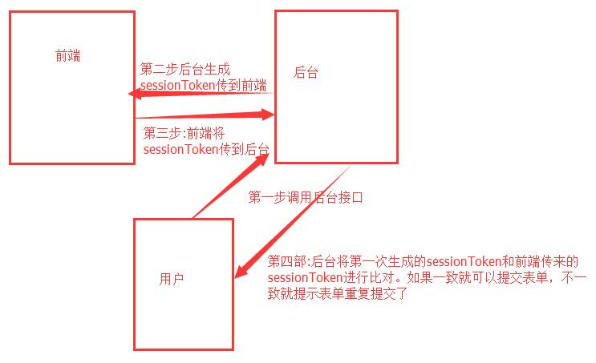

# 解决重复提交示例说明
## 1.拦截器
```
使用拦截器拦截请求，在拦截器里面用java的UUID生成一个随机的UUID并把这个UUID放到session里面，
然后在浏览器做数据提交的时候将此UUID提交到服务器。服务器在接收到此UUID后，检查一下该UUID是否已经被提交，
如果已经被提交，则不让逻辑继续执行下去…**
1.拦截@Token(save=true)注解的请求，生成随机的UUID做为token放到session里面，并把token返回给前端页面
2.前端页面提交时，拦截@Token(remove=true)请求，服务器收到token与session里的token比较，如不相同提交重复提交终止请求，如相同继续执行下去...
3.清除session里token的值
```


## 2.AOP + 缓存 --> 单机版  
```
1.拦截@LocalLock注解的请求生成一个key,这个key生成有多种方式(如:key=方法名:参数1...参数n; key=sessionId+请求路径等)只要唯一即可
2.判断key在缓存中是否存，如果存在提示重复提交 终止请求，否则就正常执行...
3.缓存key，如果单体应用缓存本地即可，如果是分布式应用 缓存到所以应用共用的缓存
4.清除key(注意key的失效时间设置)
```
## 3.AOP + 缓存(redis分布式锁) --> 集群与分布式  
### 3.1 目标
    利用 自定义注解、Spring Aop、Redis Cache 实现分布式锁，你想锁表单锁表单，想锁接口锁接口…   
### 3.2 导入依赖
在 pom.xml 中添加上 starter-web、starter-aop、starter-data-redis 的依赖即可
```xml
<dependencies>
        <dependency>
            <groupId>org.springframework.boot</groupId>
            <artifactId>spring-boot-starter-web</artifactId>
        </dependency>
        <dependency>
            <groupId>org.springframework.boot</groupId>
            <artifactId>spring-boot-starter-aop</artifactId>
        </dependency>
        <dependency>
            <groupId>org.springframework.boot</groupId>
            <artifactId>spring-boot-starter-data-redis</artifactId>
        </dependency>
    </dependencies>
```
### 3.2 属性配置
在 application.yml 资源文件中添加 redis 相关的配置项
```yaml
spring:
  redis:
    host: 10.0.103.2
    port: 6379
```
### 3.3 CacheLock 注解 
创建一个 CacheLock 注解   
* prefix： 缓存中 key 的前缀
* expire： 过期时间，此处默认为 5 秒
* timeUnit： 超时单位，此处默认为秒
* delimiter： key 的分隔符，将不同参数值分割开来
```java
@Target(ElementType.METHOD)
@Retention(RetentionPolicy.RUNTIME)
@Documented
@Inherited
public @interface CacheLock {
    /**
     * redis 锁key的前缀
     * @return redis 锁key的前缀
     */
    String prefix() default "";
    /**
     * 过期秒数,默认为5秒
     * @return 轮询锁的时间
     */
    int expire() default 5;
    /**
     * 超时时间单位
     * @return 秒
     */
    TimeUnit timeUnit() default TimeUnit.SECONDS;
    /**
     * <p>Key的分隔符（默认 :）</p>
     * <p>生成的Key：N:SO1008:500</p>
     * @return String
     */
    String delimiter() default ":";
}
```
### 3.3 CacheParam 注解 
 key 的生成规则是自己定义的，如果通过表达式语法自己得去写解析规则还是比较麻烦的，所以依旧是用注解的方式…   
```java
@Target({ElementType.PARAMETER, ElementType.METHOD, ElementType.FIELD})
@Retention(RetentionPolicy.RUNTIME)
@Documented
@Inherited
public @interface CacheParam {
    /**
     * 字段名称
     * @return String
     */
    String name() default "";
}
```
### 3.4 Key生成策略(接口与实现)
Key 生成策略（接口）：创建一个 CacheKeyGenerator 具体实现由使用者自己去注入  
```java
public interface CacheKeyGenerator {
    /**
     * 获取AOP参数,生成指定缓存Key
     * @param pjp PJP
     * @return 缓存KEY
     */
    String getLockKey(ProceedingJoinPoint pjp);
}
```
Key 生成策略（实现）：主要是解析带 CacheLock 注解的属性，获取对应的属性值，生成一个全新的缓存 Key  
```java
public class LockKeyGenerator implements CacheKeyGenerator{
    @Override
    public String getLockKey(ProceedingJoinPoint pjp) {
        MethodSignature signature = (MethodSignature) pjp.getSignature();
        Method method = signature.getMethod();
        CacheLock lockAnnotation = method.getAnnotation(CacheLock.class);
        final Object[] args = pjp.getArgs();
        final Parameter[] parameters = method.getParameters();
        StringBuilder builder = new StringBuilder();
        // TODO 默认解析方法里面带 CacheParam 注解的属性,如果没有尝试着解析实体对象中的
        for (int i = 0; i < parameters.length; i++) {
            final CacheParam annotation = parameters[i].getAnnotation(CacheParam.class);
            if (annotation == null) {
                continue;
            }
            builder.append(lockAnnotation.delimiter()).append(args[i]);
        }
        if (StringUtils.isEmpty(builder.toString())) {
            final Annotation[][] parameterAnnotations = method.getParameterAnnotations();
            for (int i = 0; i < parameterAnnotations.length; i++) {
                final Object object = args[i];
                final Field[] fields = object.getClass().getDeclaredFields();
                for (Field field : fields) {
                    final CacheParam annotation = field.getAnnotation(CacheParam.class);
                    if (annotation == null) {
                        continue;
                    }
                    field.setAccessible(true);
                    builder.append(lockAnnotation.delimiter()).append(ReflectionUtils.getField(field, object));
                }
            }
        }
        return lockAnnotation.prefix() + builder.toString();
    }
}
```
### 3.5 Lock 拦截器（AOP）  
Redis是线程安全的，利用它的特性可以很轻松的实现一个分布式锁，  
如 opsForValue().setIfAbsent(key,value)   
它的作用就是如果缓存中没有当前 Key 则进行缓存同时返回 true 反之亦然；  
当缓存后给 key 在设置个过期时间，防止因为系统崩溃而导致锁迟迟不释放形成死锁；   
那么我们是不是可以这样认为当返回 true 我们认为它获取到锁了，在锁未释放的时候我们进行异常的抛出…  
```java
@Aspect
@Configuration
public class LockMethodInterceptor {
    @Autowired
    public LockMethodInterceptor2(RedisLockHelper redisLockHelper, CacheKeyGenerator cacheKeyGenerator) {
        this.redisLockHelper = redisLockHelper;
        this.cacheKeyGenerator = cacheKeyGenerator;
    }

    private final RedisLockHelper redisLockHelper;
    private final CacheKeyGenerator cacheKeyGenerator;


    @Around("execution(public * *(..)) && @annotation(com.tzy.solution.resubmit.annotation.CacheLock)")
    public Object interceptor(ProceedingJoinPoint pjp) {
        MethodSignature signature = (MethodSignature) pjp.getSignature();
        Method method = signature.getMethod();
        CacheLock lock = method.getAnnotation(CacheLock.class);
        if (StringUtils.isEmpty(lock.prefix())) {
            throw new RuntimeException("lock key don't null...");
        }
        final String lockKey = cacheKeyGenerator.getLockKey(pjp);
        System.out.println("lockKey="+lockKey);
        String value = UUID.randomUUID().toString();
        try {
            // 假设上锁成功，但是设置过期时间失效，以后拿到的都是 false
            final boolean success = redisLockHelper.lock(lockKey, value, lock.expire(), lock.timeUnit());
            if (!success) {
                throw new RuntimeException("重复提交");
            }
            try {
                return pjp.proceed();
            } catch (Throwable throwable) {
                throw new RuntimeException("系统异常");
            }
        } finally {
            // TODO 如果演示的话需要注释该代码;实际应该放开
            redisLockHelper.unlock(lockKey, value);
        }
    }
}
```
RedisLockHelper通过封装成 API 方式调用，灵活度更加高  
```java
@Configuration
@AutoConfigureAfter(RedisAutoConfiguration.class)
public class RedisLockHelper {

    private static final String DELIMITER = "|";

    /**
     * 如果要求比较高可以通过注入的方式分配
     */
    private static final ScheduledExecutorService EXECUTOR_SERVICE = Executors.newScheduledThreadPool(10);

    private final StringRedisTemplate stringRedisTemplate;

    public RedisLockHelper(StringRedisTemplate stringRedisTemplate) {
        this.stringRedisTemplate = stringRedisTemplate;
    }

    /**
     * 获取锁（存在死锁风险）
     * @param lockKey lockKey
     * @param value   value
     * @param time    超时时间
     * @param unit    过期单位
     * @return true or false
     */
    public boolean tryLock(final String lockKey, final String value, final long time, final TimeUnit unit) {
        return stringRedisTemplate.execute((RedisCallback<Boolean>) connection -> connection.set(lockKey.getBytes(), value.getBytes(), Expiration.from(time, unit), RedisStringCommands.SetOption.SET_IF_ABSENT));
    }

    /**
     * 获取锁
     * @param lockKey lockKey
     * @param uuid    UUID
     * @param timeout 超时时间
     * @param unit    过期单位
     * @return true or false
     */
    public boolean lock(String lockKey, final String uuid, long timeout, final TimeUnit unit) {
        final long milliseconds = Expiration.from(timeout, unit).getExpirationTimeInMilliseconds();
        boolean success = stringRedisTemplate.opsForValue().setIfAbsent(lockKey, (System.currentTimeMillis() + milliseconds) + DELIMITER + uuid);
        if (success) {
            stringRedisTemplate.expire(lockKey, timeout, TimeUnit.SECONDS);
        } else {
            String oldVal = stringRedisTemplate.opsForValue().getAndSet(lockKey, (System.currentTimeMillis() + milliseconds) + DELIMITER + uuid);
            final String[] oldValues = oldVal.split(Pattern.quote(DELIMITER));
            if (Long.parseLong(oldValues[0]) + 1 <= System.currentTimeMillis()) {
                return true;
            }
        }
        return success;
    }


    /**
     * @see <a href="http://redis.io/commands/set">Redis Documentation: SET</a>
     */
    public void unlock(String lockKey, String value) {
        unlock(lockKey, value, 0, TimeUnit.MILLISECONDS);
    }

    /**
     * 延迟unlock
     * @param lockKey   key
     * @param uuid      client(最好是唯一键的)
     * @param delayTime 延迟时间
     * @param unit      时间单位
     */
    public void unlock(final String lockKey, final String uuid, long delayTime, TimeUnit unit) {
        if (StringUtils.isEmpty(lockKey)) {
            return;
        }
        if (delayTime <= 0) {
            doUnlock(lockKey, uuid);
        } else {
            EXECUTOR_SERVICE.schedule(() -> doUnlock(lockKey, uuid), delayTime, unit);
        }
    }

    /**
     * @param lockKey key
     * @param uuid    client(最好是唯一键的)
     */
    private void doUnlock(final String lockKey, final String uuid) {
        String val = stringRedisTemplate.opsForValue().get(lockKey);
        final String[] values = val.split(Pattern.quote(DELIMITER));
        if (values.length <= 0) {
            return;
        }
        if (uuid.equals(values[1])) {
            stringRedisTemplate.delete(lockKey);
        }
    }
}
```
控制层
在接口上添加 @CacheLock(prefix = "books")，然后动态的值可以加上@CacheParam；生成后的新 key 将被缓存起来；  
（如：该接口 token = 1，那么最终的 key 值为 books:1，如果多个条件则依次类推）  
```java
@RestController
@RequestMapping("/books")
public class BookController {

    @CacheLock(prefix = "books")
    @GetMapping
    public String query(@CacheParam(name = "token") @RequestParam String token) {
        return "success - " + token;
    }

}
```


